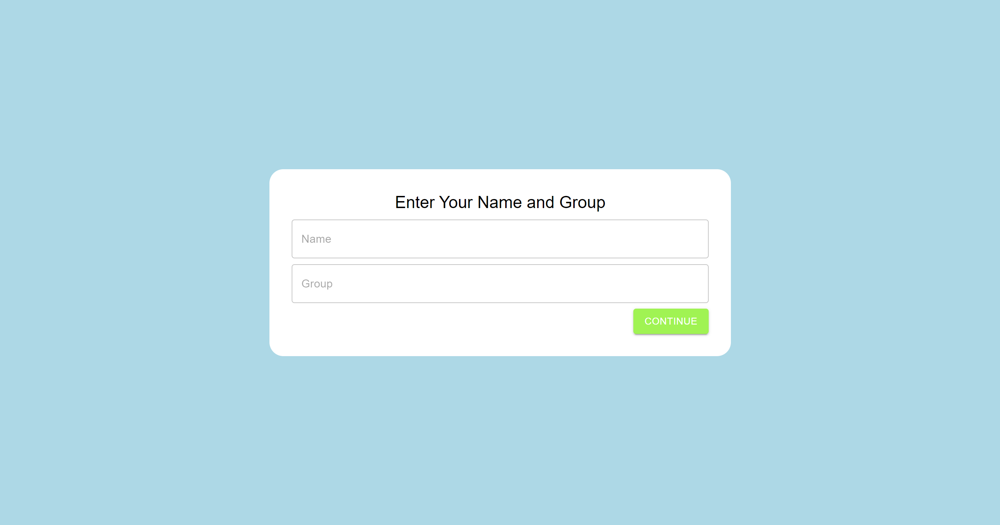
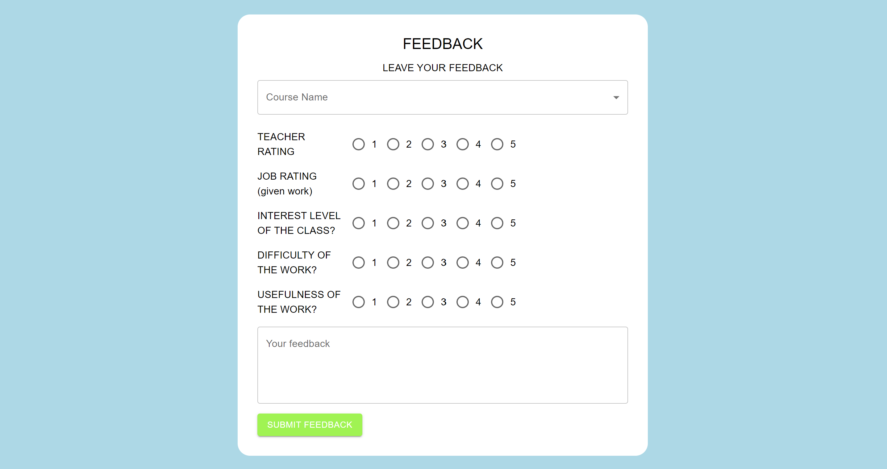
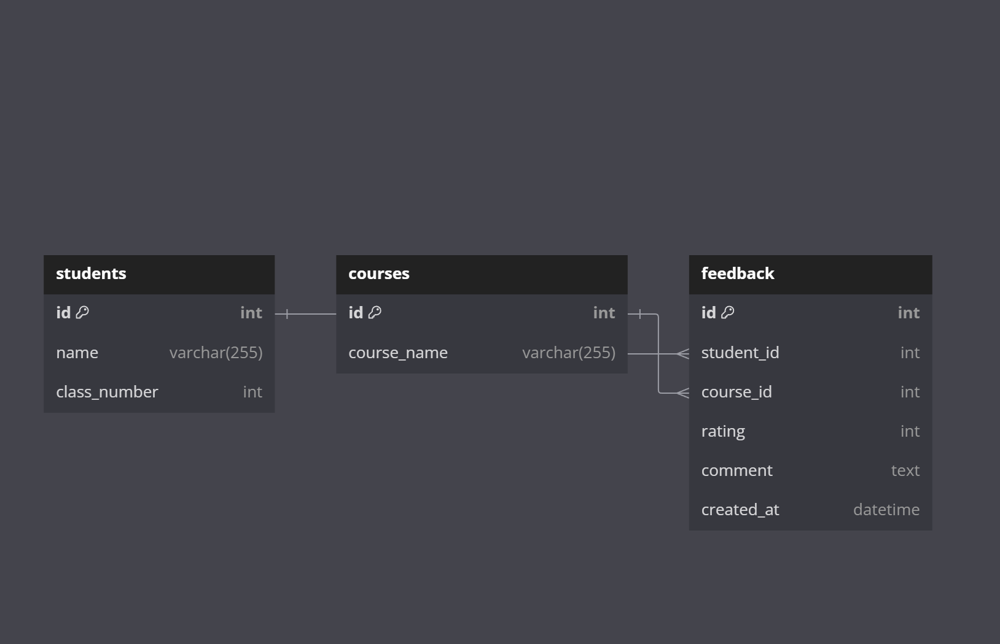
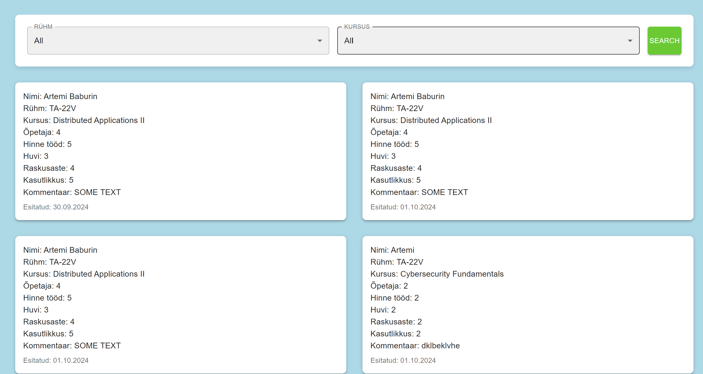

# TA-22V Jira Kooliproject

## Project Overview
This is a **simple school project** developed using **Jira tasks** with a sprint-based workflow. The main objective was to create a feedback application that enables users to evaluate courses and submit their feedback through an intuitive form.

## Key Features

- **Feedback Form:** A user-friendly form where users can submit feedback about courses.
- **Submitted Feedback Display:** View submitted feedback requests displayed in an organized and concise manner on the website.

## Technology Stack

- **Backend:** Built with **Golang**, providing high performance and concurrency support.
- **Database:** Using **PostgreSQL** for storing course and feedback data, ensuring scalability and data integrity.
- **Frontend:** Created with **React**, leveraging the **Zustand** state management library for efficient state handling.

## Screenshots

1. **Name & Course Selection**  
   

2. **Feedback Submission Form**  
   

3. **Simple Database Schema**  
   

4. **All Feedbacks**  
   

5. **Nothing Found Filtering Functionality**  
   
